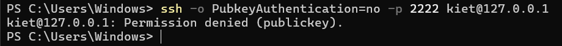
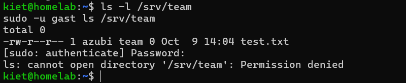
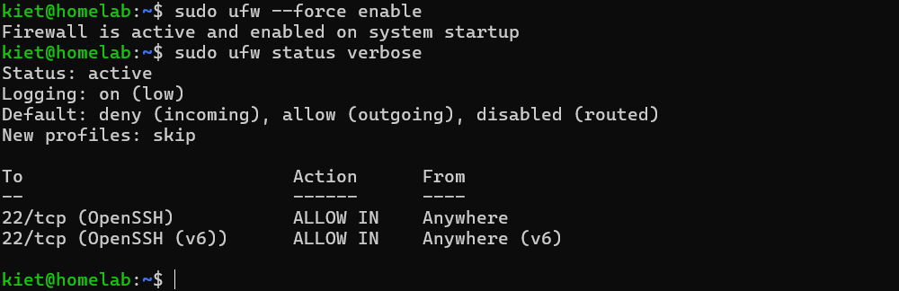
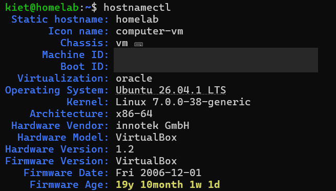

# Projekt 1: Linux-Server im Homelab

## Ziel
Einen eigenen Linux-Server in einer virtuellen Maschine aufsetzen und so absichern, wie es in Unternehmen üblich ist.

## Umgebung
- Host: Windows-Laptop, 16 GB RAM
- Virtualisierung: VirtualBox 7.2
- Server: Ubuntu Server 26.04.1 LTS (2 CPUs, 4 GB RAM, 30 GB)

## Umsetzung
1. VM erstellt und Ubuntu Server manuell installiert; Installationsdatei per SHA256-Prüfsumme überprüft
2. SSH-Zugriff vom Windows-Host über Port-Weiterleitung (2222 → 22, nur über localhost erreichbar)
3. Anmeldung nur per SSH-Schlüssel (ed25519); Passwort-Login und Root-Login deaktiviert
4. Benutzer und Gruppen: gemeinsamer Ordner `/srv/team` mit Rechten `2770` – nur die Gruppe `team` hat Zugriff
5. Firewall mit ufw: eingehende Verbindungen standardmäßig blockiert, nur SSH erlaubt
6. Automatische Sicherheitsupdates mit `unattended-upgrades`
7. Snapshot als Wiederherstellungspunkt

## Ergebnis

**Passwort-Login wird abgelehnt – nur SSH-Schlüssel sind erlaubt:**

**Rechte auf `/srv/team`: Gruppenmitglieder haben Zugriff, der Benutzer `gast` nicht:**

**Firewall-Status:**

**Systeminformationen:**

## Probleme & Lösungen

| Problem | Ursache | Lösung |
|---|---|---|
| ISO-Datei nur 1,5 MB statt 2,7 GB | Download abgebrochen | Neu heruntergeladen und mit SHA256-Prüfsumme überprüft |
| `Login incorrect` an der VM-Konsole | Passwort falsch eingegeben – Linux zeigt bei der Eingabe keine Zeichen an, Tippfehler bleiben daher unbemerkt | Passwort langsam und sorgfältig erneut eingegeben |
| Befehle mit „-“ schlugen in der VM-Konsole fehl | Tastaturlayout der VM war Deutsch statt US | Administration per SSH vom Windows-Host |
| SSH-Verbindung getrennt (`Connection reset`) | Passwort nicht innerhalb von 2 Minuten eingegeben (LoginGraceTime) | Neu verbunden und Passwort zügig eingegeben |
| Benutzer `kiet` hatte keinen Zugriff auf `/srv/team` | Neue Gruppenrechte gelten erst nach erneuter Anmeldung | Ab- und wieder angemeldet |
| `ufw enable` brach mit `UnicodeDecodeError` ab | Vietnamesische Eingabemethode (Unikey) erzeugte Sonderzeichen bei der Bestätigung | Eingabemethode auf Englisch gestellt, `ufw --force enable` verwendet |
| `Connection refused` beim SSH-Login | VM war noch nicht vollständig gestartet | Auf den Login-Prompt gewartet und erneut verbunden |

## Was ich gelernt habe
- Ein Server wird normalerweise aus der Ferne per SSH verwaltet – nicht direkt am Gerät.
- Sicherheit besteht aus mehreren Schichten: SSH-Schlüssel statt Passwort, Benutzerrechte, Firewall und automatische Updates.
- Fehlermeldungen genau zu lesen lohnt sich: Die meisten Probleme hatten eine einfache Ursache, zum Beispiel das Tastaturlayout oder die Eingabemethode.

## Nächster Schritt
Projekt 2: eigene Cloud mit Nextcloud und Docker auf diesem Server.
