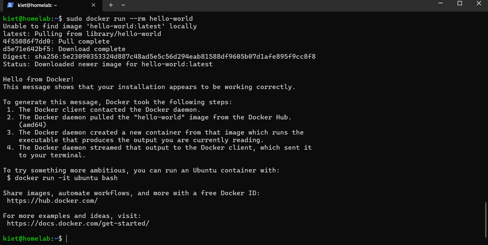
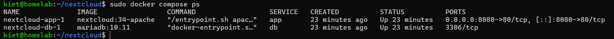
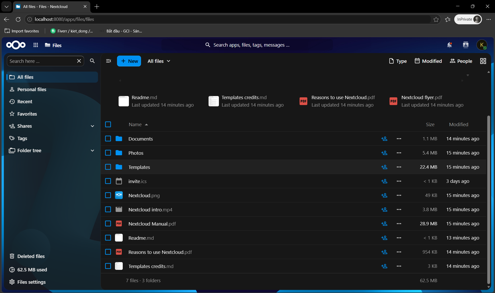
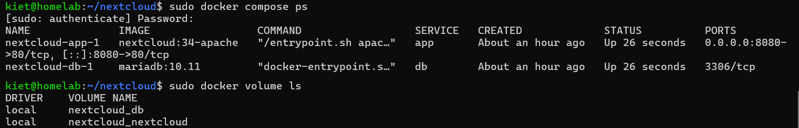
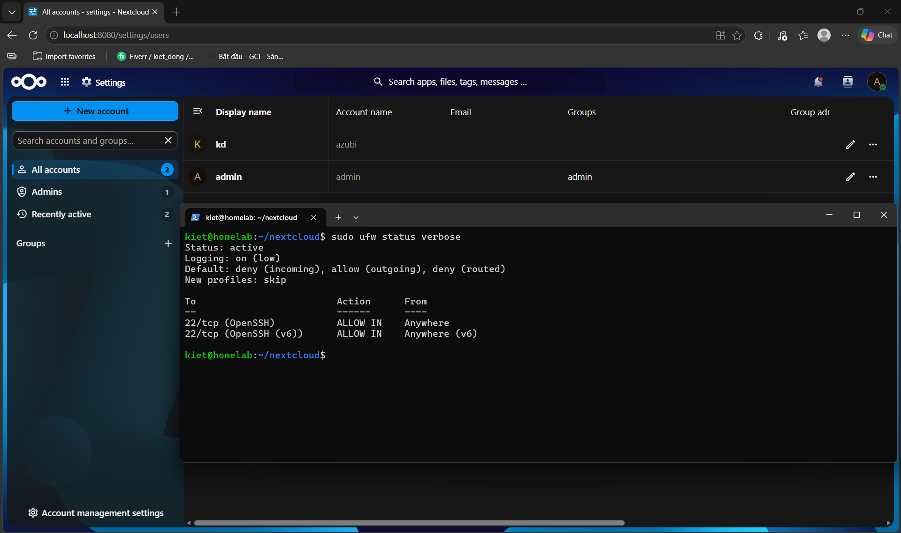

# Projekt 2: Eigene Cloud mit Nextcloud und Docker

## Ziel
Eine eigene Cloud (wie Google Drive) auf dem Linux-Server aus [Projekt 1](../01-linux-server) betreiben – mit Docker Compose, reproduzierbar aus einer einzigen Datei.

## Umgebung
- Server: Ubuntu Server 26.04 LTS in VirtualBox (aus Projekt 1)
- Docker Engine und Docker Compose v2.40 (Ubuntu-Pakete)
- Nextcloud 34 (Apache) und MariaDB 10.11 als Container

## Aufbau
Browser (Windows) → VirtualBox-Portweiterleitung 127.0.0.1:8080 → VM :8080 → Container `app` :80 → Container `db` :3306

Die Daten liegen in zwei Docker-Volumes: `nextcloud` (Dateien) und `db` (Datenbank).

## Umsetzung
1. Docker und Docker Compose installiert, Test mit `hello-world`
2. Passwörter zufällig erzeugt (`openssl rand -hex 16`) und in `.env` gespeichert (Rechte 600, nicht im Repository)
3. Zwei Dienste in [`compose.yaml`](compose.yaml): Nextcloud und MariaDB, Daten in Docker-Volumes
4. Feste Hauptversion `nextcloud:34-apache`, weil Nextcloud beim Update keine Hauptversion überspringen darf
5. Automatische Installation über Umgebungsvariablen; Admin und Testbenutzer `azubi` angelegt, Testdatei hochgeladen
6. Neustart-Test: Die Container starten durch `restart: always` von selbst, die Dateien bleiben erhalten
7. Snapshot `projekt2-fertig` als Wiederherstellungspunkt

## Ergebnis

## Sicherheit
- Zugriff nur vom Laptop (Portweiterleitung auf 127.0.0.1)
- Docker-Befehle nur mit `sudo`, kein Benutzer in der Gruppe `docker` (wäre gleichbedeutend mit root)
- Passwörter nur in `.env`; im Repository liegt nur [`.env.example`](.env.example)
- **Erkenntnis:** Docker umgeht die Firewall ufw. ufw erlaubt nur Port 22, trotzdem ist Nextcloud über Port 8080 erreichbar, weil Docker eigene iptables-Regeln setzt. Auf einem echten Server: Regeln in der Kette `DOCKER-USER` oder ein Reverse Proxy davor.

## Bewusst weggelassen
HTTPS, Redis-Cache und Cron-Hintergrundjobs: für einen lokalen Testserver nicht nötig, für einen echten Betrieb schon.

## Probleme & Lösungen
| Problem | Ursache | Lösung |
|---|---|---|
| SSH: `Connection reset` / `Connection aborted` | VM war noch nicht vollständig gestartet | Auf `homelab login:` gewartet, dann neu verbunden |
| Passwörter im Screenshot sichtbar (`cat .env`) | Datei zur Kontrolle komplett ausgegeben | Vor dem ersten Start neu erzeugt; Kontrolle nur noch über die Länge (`awk`) |
| `unknown docker command: "compose log"` | Tippfehler: `log` statt `logs` | Befehl korrigiert; Fehlermeldungen von unten nach oben lesen |
| Terminal reagierte beim Tippen nicht | Windows-Eingabesprache auf Vietnamesisch (VI) umgesprungen | Mit Win+Leertaste auf ENG US zurückgestellt |
| Admin-Login: `Wrong login or password` | Passwort beim Kopieren aus dem Terminal nicht richtig übernommen | Passwort erneut kopiert (Doppelklick, Strg+Umschalt+C) |

## Was ich gelernt habe
Ich habe gelernt, wie man mit einer einzigen Datei (`compose.yaml`) zwei Programme startet, die zusammenarbeiten. Außerdem weiß ich jetzt, dass Docker die Firewall umgeht: Eine Regel in ufw allein reicht nicht, man muss prüfen, was wirklich erreichbar ist. Und ich habe gemerkt, wie schnell ein Passwort in einem Screenshot landet.

## Nächster Schritt
Projekt 3: automatische Datensicherung dieser Nextcloud.
